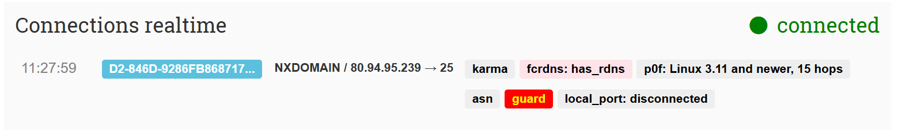

# Poste-io
The config is designed to be used with a VPS, that has its own external IP, and has a connection back to your on-prem, either via WireGuard, Tailscale or other.  
## Pre-Reqs
1. A configured network interface (WireGuard, Tailscale, etc.) to allow connectivity back to your on-prem.  
2. A directory on the servers root called /data/certs/traefik_certs  
3. A directory on the servers root called /data/certs/poste_certs
4. A directory on the servers root called /data/scripts  
5. Ideally a remote system to run connectivity tests from OR a VPN connection like NordVPN  

## Deploy Portainer
Login to server, re-create the [portainer-agent.yaml](./portainer-agent.yaml) file.  
_Modify the IP addresses in the port bindings to your non-external facing IPs._  

`docker-compose -f ./deploy-portainer-agent.yaml -p portainer-agent up -d`  
This will deploy portainer to a stack called 'portainer-agent' in the background (not foreground) and will allow you to connect your on-prem/remote portainer server to the system for easier container management.  

## Deploy Traefik
In your portainer interface, copy the [traefik_and_cert_dumper.yaml](./traefik_and_cert_dumper.yaml) file contents to a new stack.  
Edit the variables in the file to your own, and the IP addresses on the ports again.  
Then deploy.  

## Certificates
At this point, wait 10-15mins for Traefik to requests its initial certificates and dump to its acme.json file in its working folder.
### Setup automatic copy job
#### Create Script
Create the [copy script](./update_cert_for_poste-io.sh), in `data/scripts` then make the file executable with `chmod +x /data/scripts/update_cert_for_poste-io.sh`.  
#### Edit Crontab  
Run `crontab -e` and add the following to the bottom of the file.  
You can edit the cron timings, but this will run the script at 5am on the first day of each month with the current settings, and output that it has ran to syslog too.  
```sh
# Update acme certificate for export to poste
0 5 1 * * /data/scripts/update_cert_for_poste-io.sh | logger -t update_cert_for_posteio
```
_Note, whilst you can techincally just have Traefik store its acme.json file elseware in the config, a common bug is for it to not work properly and instead create a folder instead of a json file, or even if you pre-create the json file, it will ignore permissions and just not work. This method sidesteps that._  

## Deploy Poste
In your portainer interface, copy the [poste-io.yaml](./poste-io.yaml) file contents to a new stack.  
Edit the variables in the file to your own, and the IP addresses on the ports again.  
Then deploy.  

## Test Connectivity
### SMTP
This [SMTP Test Tool](https://github.com/georgjf/SMTPtool) for windows is a good way to test basic connectivity to your SMTP server.  
_Note: Make sure you have set your local connected IP range to the list of allowed relay networks first._  
On the SMTP session tab, when you click connect, you should expect to see similar too -   
```
Connecting to mail.domain.com on port25

<< 220 mail.domain.com ESMTP Haraka ready
```  
You can also verify that Poste see's the original source IP by checking the dashboard screen, and seeing if a live connection from an external testing service, like [MX Toolbox](https://mxtoolbox.com/diagnostic.aspx) shows its original IP, and not the IP of your docker network.  
Example -  
  

### IMAP & TLS
Run the following commands on CLI to check for certificate usage on your SMTPS, IMAP & POP3S ports.  

```sh
HOST=mail.domain.com
# test the SMTP port 587 with STARTTLS
echo | openssl s_client -servername $HOST -connect $HOST:587 -starttls smtp 2>/dev/null | openssl x509 -noout -issuer -subject -dates
# test the SMTPS & IMAPS ports
for PORT in 465 993; do echo | openssl s_client -servername $HOST -connect $HOST:$PORT 2>/dev/null | openssl x509 -noout -issuer -subject -dates; done
```  

## Security
On your VPS, run - `ip addr show eth0` to get your external IP address.  
#### Web Scanner
On [web based scanner](https://dnschecker.org/port-scanner.php), run a query against the ports you would expect to be open and closed on your server, with 'timed out','rejected' or 'dropped' being the states you would want to see.  

### NMAP
On your remote system, or on a VPN, run the following command syntax from CLI to do a port scan -   
`nmap -p x,y,z,a,b,c IP_Address`  
Example for poste w/ Traefik -  
`nmap -p 22,25,80,443,587,993,8081,9001 1.2.3.4`  

